# Expense Tracker App

A modern Android Expense Tracker application built using Kotlin and Firebase.

## Features

- User Authentication (Login/Register)
- Add Income and Expenses
- Edit and Delete Expenses
- Search Expenses
- Filter by Income/Expense
- Monthly Summary
- Budget Limit Tracking
- PDF Report Export
- Analytics Charts
- Category Analytics
- Dark Mode UI
- Firebase Firestore Database
- Search and filter expenses by title, category, income, and expense
- Recent transactions on dashboard
- Room Database offline cache support
- MVVM Architecture
- StateFlow Reactive UI
- Swipe To Refresh
- Offline Data Access

## Tech Stack

- Kotlin
- Android Studio
- Firebase Authentication
- Firebase Firestore
- MPAndroidChart
- RecyclerView
- Material Design
- Room Database
- StateFlow
- MVVM Architecture

## Screenshots

### Login Screen
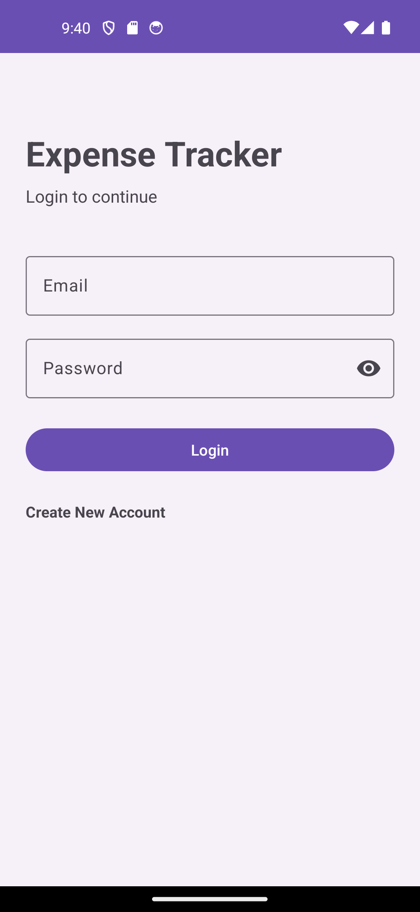

### Register Screen
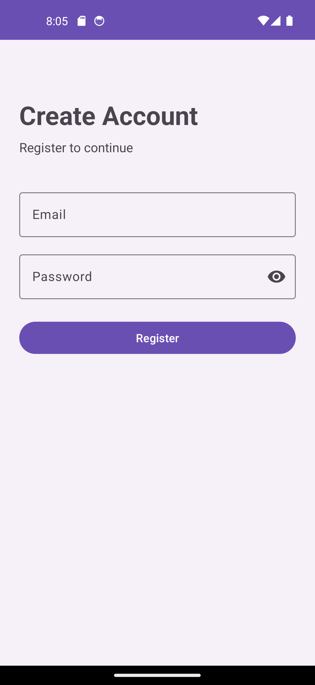

### Home Dashboard
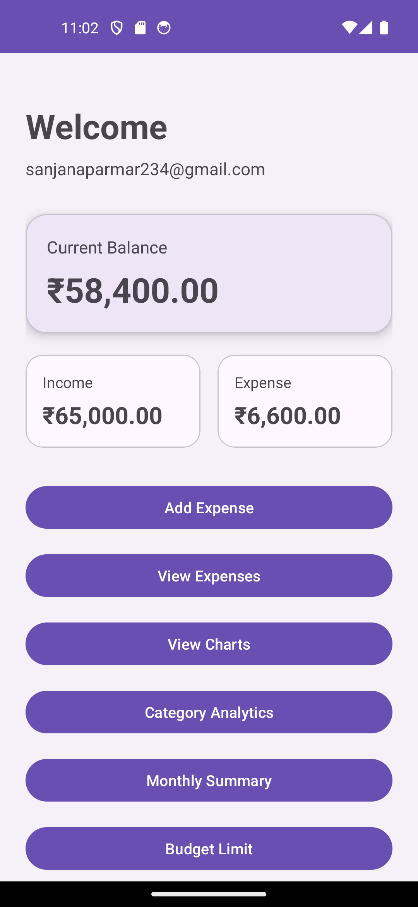

### Dashboard Features
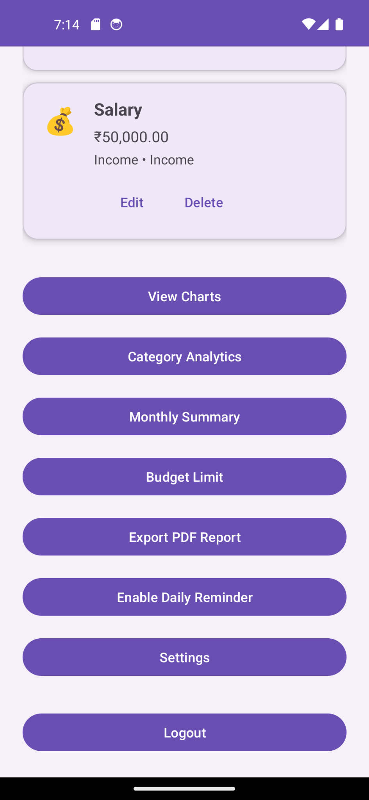

### Add Expense
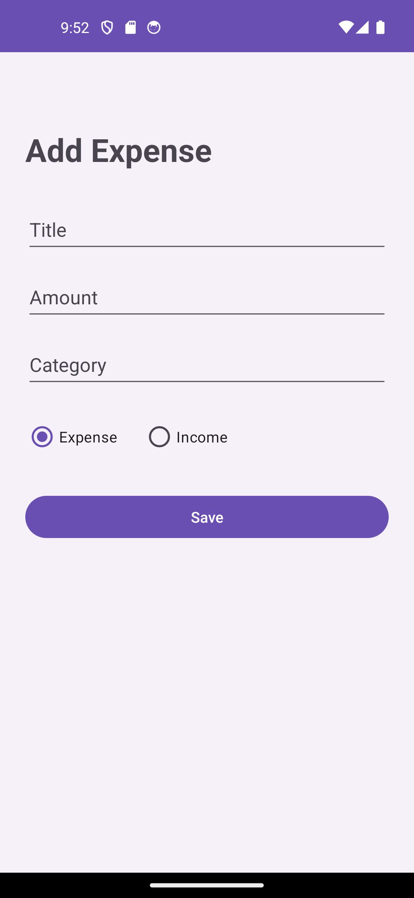

### Expense List
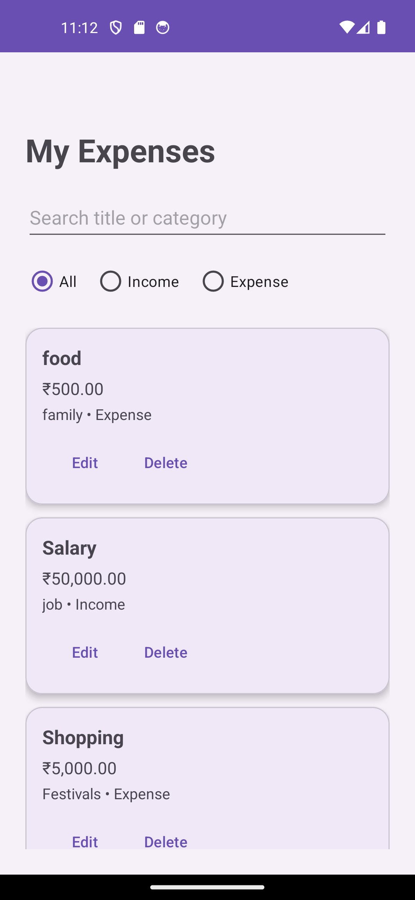

### Analytics Chart
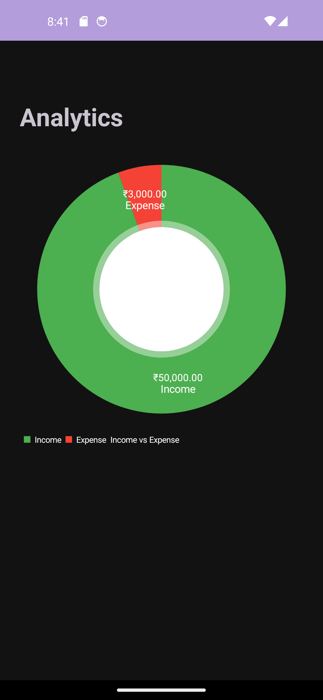

### Category Analytics
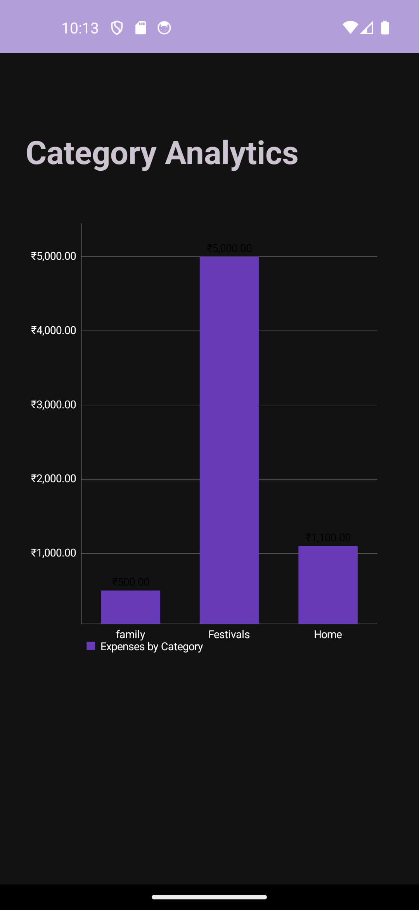

### Monthly Summary
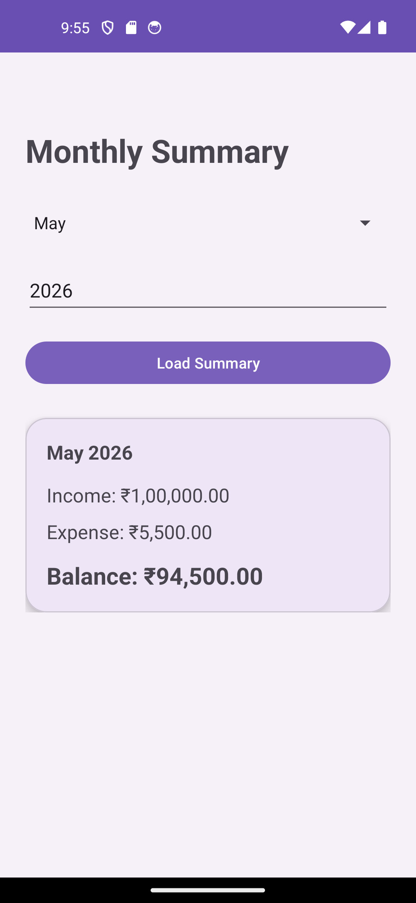

### Budget Limit
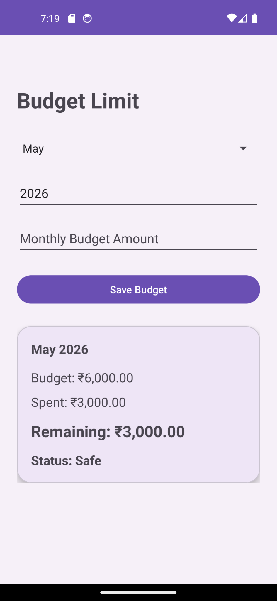

### PDF Export
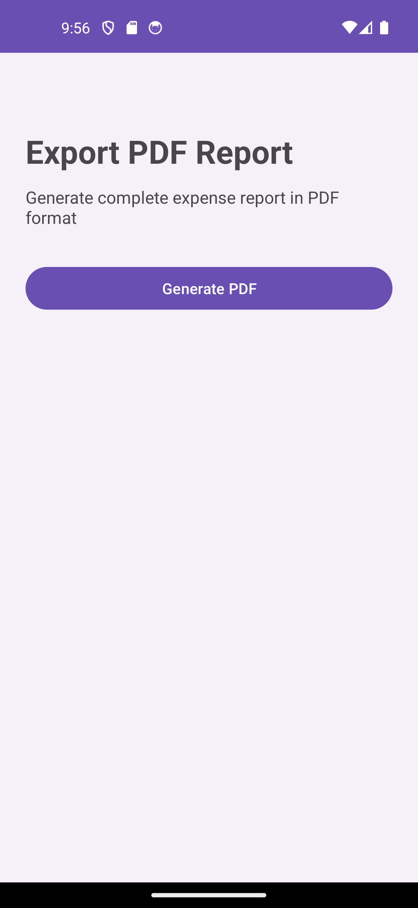

### Dark Mode
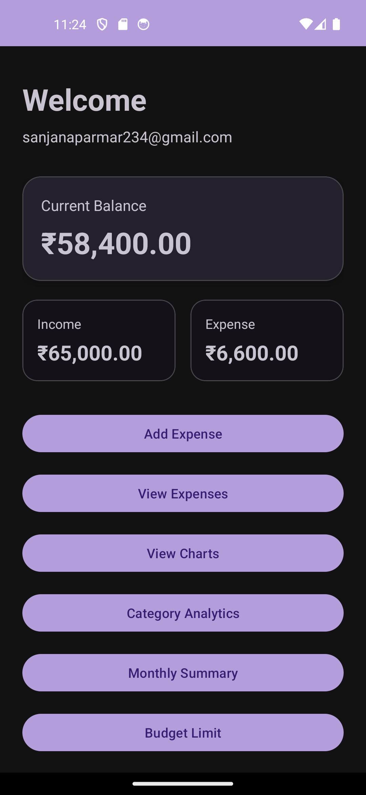

## Author

Sanju Parmar

## Project Status

In Progress - Advanced Android portfolio project