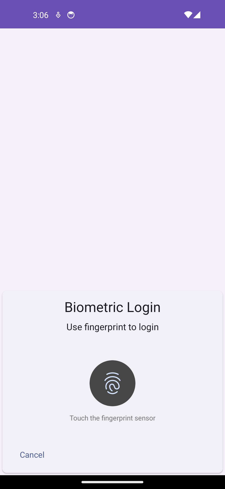
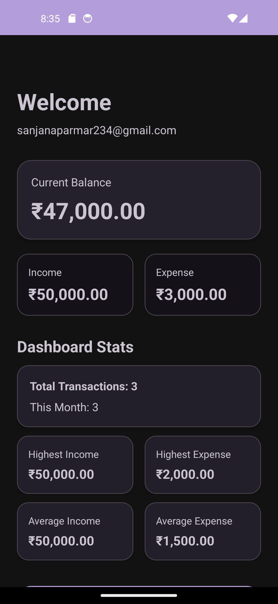
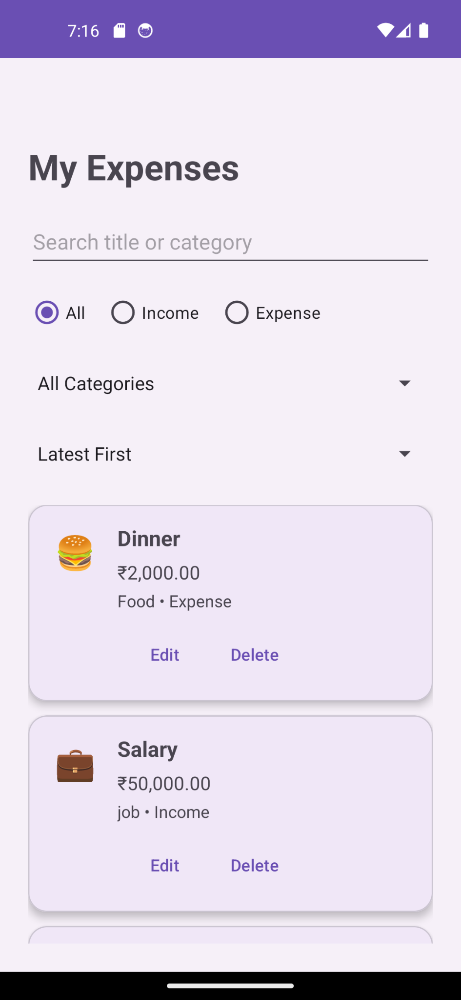
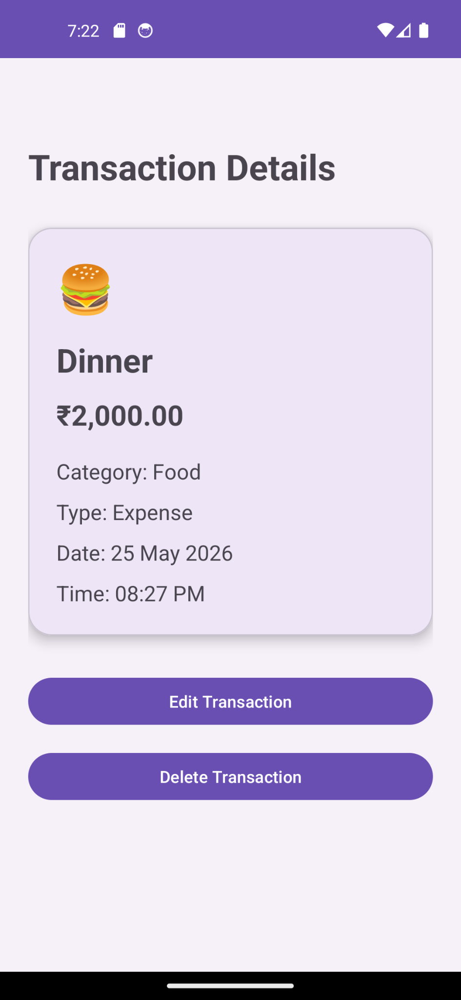
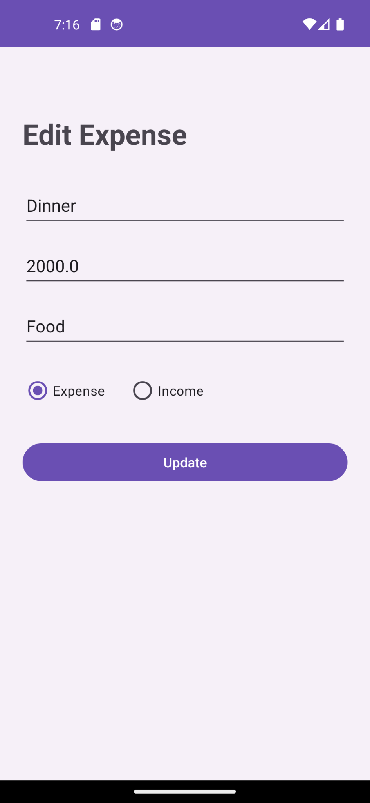
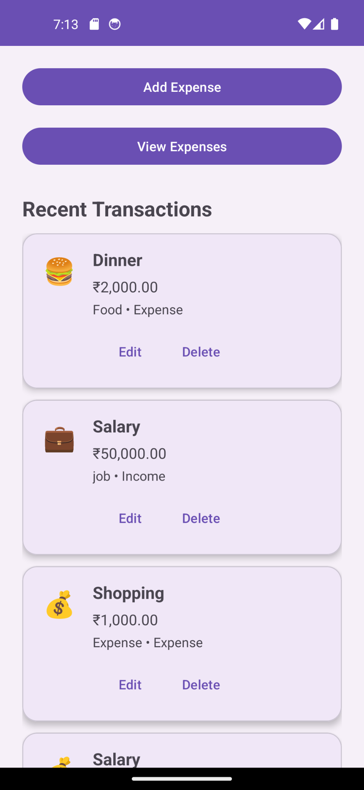
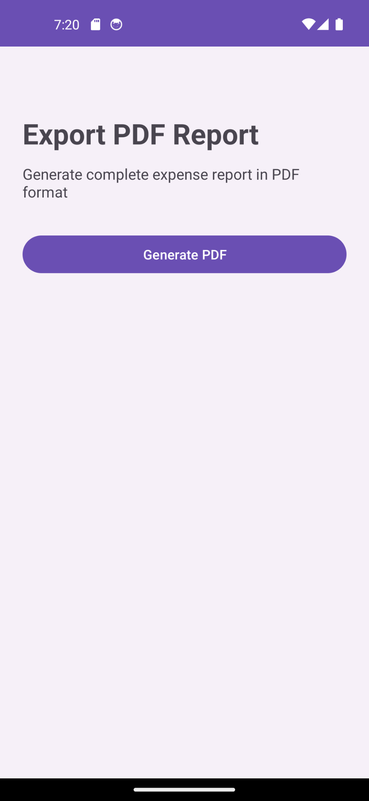
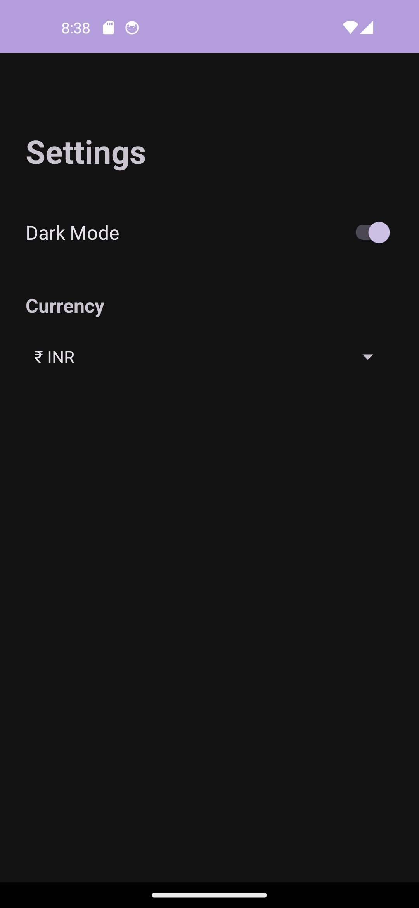

# Expense Tracker Android App

A modern Android Expense Tracker application built using Kotlin, Firebase, MVVM Architecture, Room Database, Hilt, and StateFlow.

---

# Features

## Authentication & Security
- Firebase Authentication
- User Login & Registration
- Biometric Fingerprint Login
- Splash Screen Session Management

## Expense Management
- Add Income & Expenses
- Edit & Delete Transactions
- Transaction Details Screen
- Expense Category Icons
- Search Expenses
- Advanced Expense Filtering
- Category Filter
- Sort by Latest / Oldest
- Sort by Amount

## Dashboard & Analytics
- Dashboard Statistics
- Highest Income Tracking
- Highest Expense Tracking
- Average Income Analysis
- Average Expense Analysis
- Monthly Transaction Insights
- Analytics Charts
- Category Analytics
- Monthly Summary

## Settings & Personalization
- Persistent Dark Mode
- Multi-Currency Support
- Currency Selection (INR, USD, EUR, GBP)
- Settings Screen

## Offline & Data Management
- Firebase Firestore Database
- Room Database Offline Cache
- Offline Data Access
- Swipe To Refresh
- DataStore Preferences

## Extra Features
- PDF Report Export
- Budget Limit Tracking
- Recent Transactions Dashboard
- Empty State UI

---

# Tech Stack

- Kotlin
- Android Studio
- Firebase Authentication
- Firebase Firestore
- MVVM Architecture
- StateFlow
- Hilt Dependency Injection
- Room Database
- DataStore Preferences
- RecyclerView
- Material Design 3
- MPAndroidChart
- Kotlin Coroutines

---

# Architecture

This project follows:

- MVVM Architecture
- Repository Pattern
- Clean UI State Management using StateFlow
- Dependency Injection using Hilt
- Offline First Approach using Room Database

---

# Screenshots

## Login Screen


---

## Register Screen


---

## Biometric Login


---

## Dashboard Overview (Dark Mode)


---

## Dashboard Features


---

## Add Expense


---

## View Expenses


---

## Transaction Details


---

## Edit Expense


---

## Dashboard Transactions


---

## Analytics Chart (Dark Mode)


---

## Category Analytics


---

## Monthly Summary


---

## Budget Limit


---

## Export PDF Report


---

## Settings Screen (Dark Mode)


---

# Folder Structure

```text
app/
├── data/
├── di/
├── repository/
├── ui/
├── utils/
└── viewmodel/
```

---

# Installation

1. Clone the repository

```bash
git clone https://github.com/your-username/ExpenseTracker.git
```

2. Open project in Android Studio

3. Add your Firebase configuration file:

```text
google-services.json
```

4. Sync Gradle and Run the project

---

# Future Improvements

- Expense Notifications
- Cloud Backup
- CSV Export
- Expense Sharing
- Advanced Financial Reports

---

# Author

## Sanju Parmar

Android Developer | Kotlin | Firebase | MVVM

---

# Project Status

Advanced Android Portfolio Project 🚀